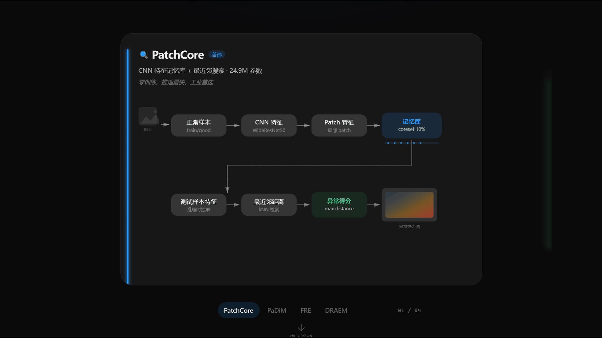
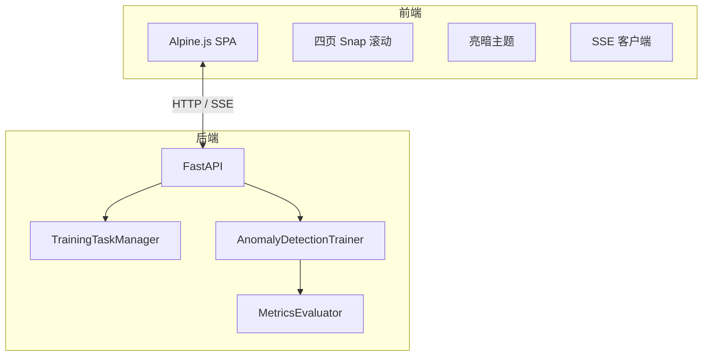
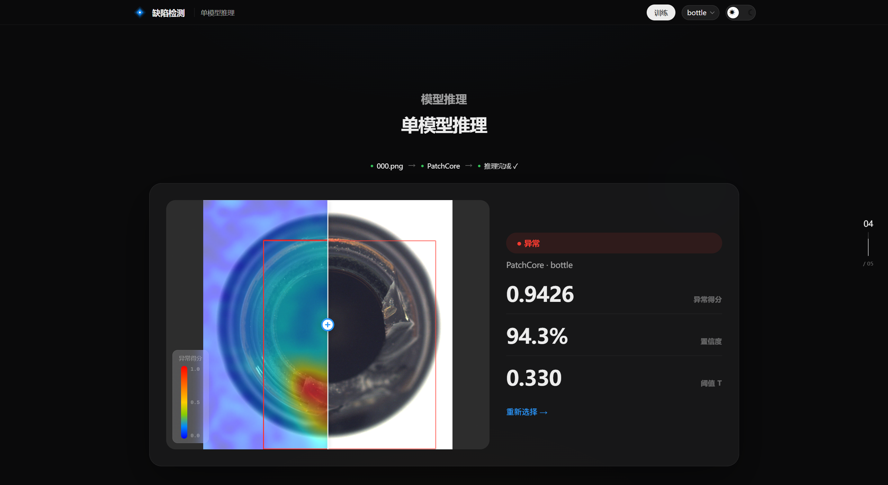
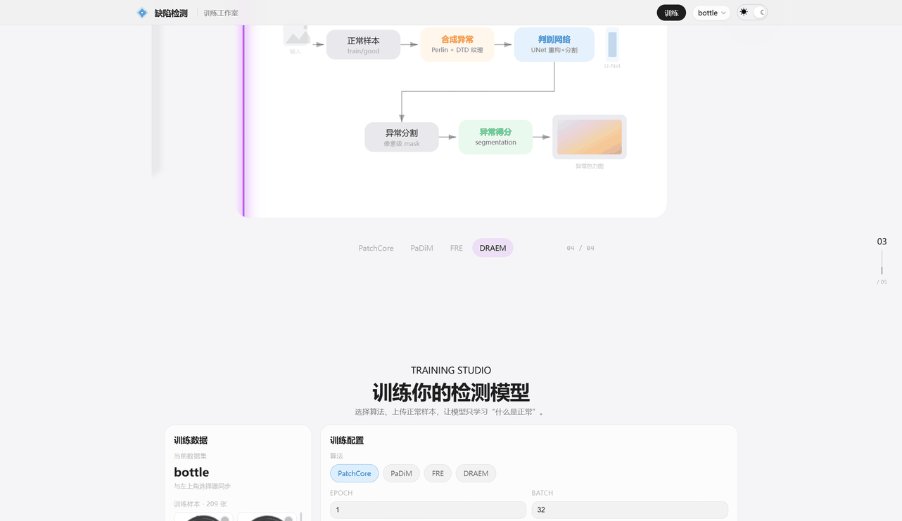
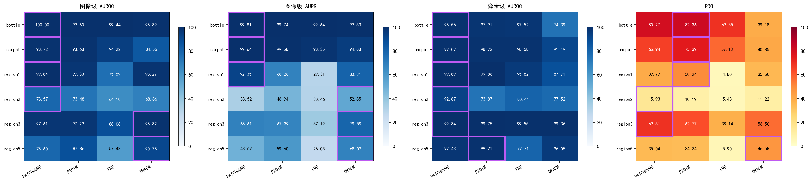
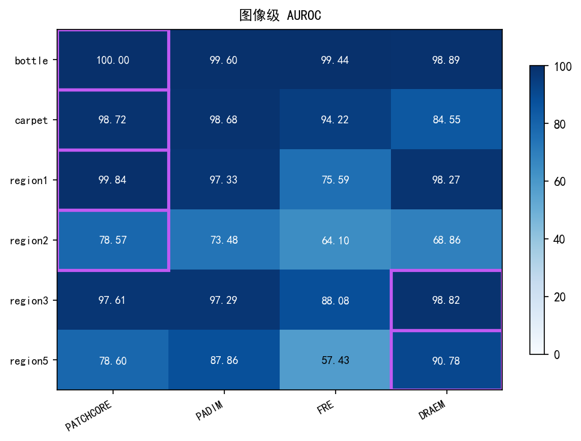
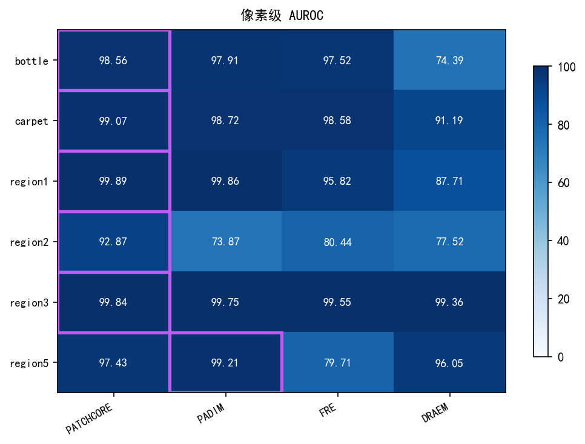
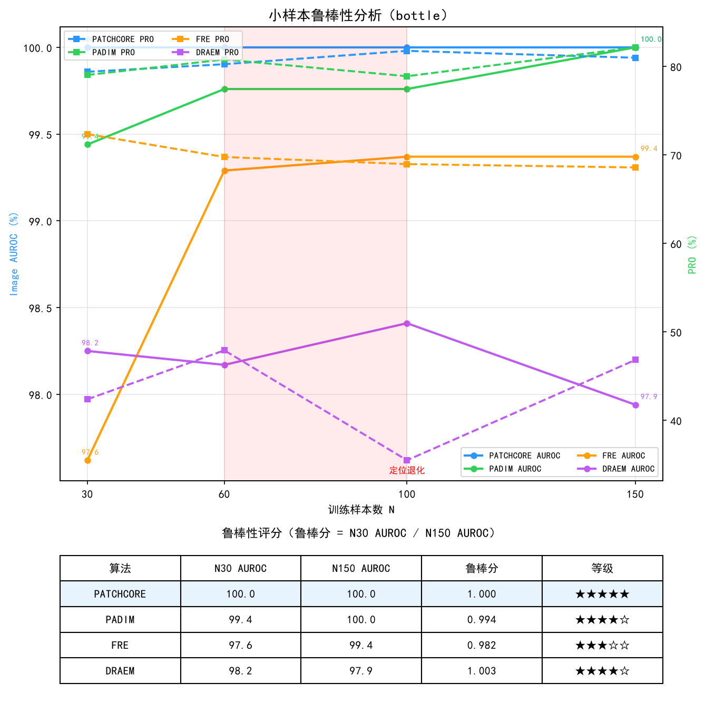

# 工业图像异常检测

<p align="center">
  
</p>

<p align="center">
  
  
  
  
  
</p>

<p align="center">
  基于 <strong>anomalib 2.3.0</strong> 的无监督工业缺陷检测系统。<br>
  仅用<strong>正常样本</strong>训练，四种算法覆盖特征建模、重构误差、自监督判别三条技术路线。
</p>

---

## ✨ 功能特性

| 特性 | 说明 |
|:---|:---|
| 🌗 **亮暗双主题** | 系统级 `prefers-color-scheme` 自动适配，一键切换，CSS 变量全链路覆盖 |
| 📜 **四页 Snap 滚动** | CSS Scroll Snap 全屏吸附，Hero / Training / Inference / Compare 四页沉浸式浏览 |
| ⚡ **SSE 流式推理** | FastAPI Server-Sent Events 实时推送热力图、bbox、得分与进度 |
| 🎓 **Training Studio** | 上传正常样本、调参、自训练模型，SSE 实时返回 loss / AUROC / ETA |
| 🔬 **四模型对比墙** | 2×2 画廊式网格，同步对比 PatchCore / PaDiM / FRE / DRAEM |
| ♿ **无障碍降级** | 尊重 `prefers-reduced-motion`，动画可静默关闭 |
| 📊 **一键可视化** | `tools/viz/run_all.py` 生成论文/汇报所需的 8 张图表 |

---

## 🧠 算法

<p align="center">
  
</p>

*bottle 数据集代表结果，完整数据见 `results/comparison/`*

| 算法 | 路线 | image_AUROC | pixel_AUROC | PRO | 参数量 | 推荐 |
|:---|:---|:---:|:---:|:---:|:---:|:---:|
| **PatchCore** | 特征记忆库 + 最近邻 | 100% | 98.6% | 80.1% | 24.9M | ✅ 首选 |
| **PaDiM** | patch 高斯建模 + 马氏距离 | 100% | 98.2% | 80.2% | 2.8M | ✅ 轻量 |
| **FRE** | 特征重构误差 | 99.4% | 97.5% | 69.1% | 23.0M | 🔬 备选 |
| **DRAEM** | 合成异常 + 判别网络 | 97.7% | 86.2% | 48.3% | 97.4M | 🔬 备选 |

| 论文 | 来源 |
|:---|:---|
| PatchCore | Roth et al., CVPR 2022 |
| PaDiM | Defard et al., ICPR 2021 |
| DRAEM | Zavrtanik et al., ICCV 2021 |
| FRE | Batzner et al., 2024 |

---

## 🏗️ 系统架构

### 数据流


### 前后端架构



---

## 📦 安装

```bash
mamba create -n anomalib python=3.10 -y
mamba activate anomalib
mamba install pytorch torchvision pytorch-cuda=11.8 -c pytorch -c nvidia -y
pip install -r requirements.txt
```

> 依赖版本已锁定在 `requirements.txt`。anomalib 2.3.0 配套 PyTorch Lightning 1.9.5 兼容补丁位于 `modules/algorithm/_anomalib_compat.py`，升级 anomalib 前请同步更新。

验证安装：

```bash
python -m pytest tests/test_metrics.py tests/test_viz.py -v
python -c "from modules.algorithm.trainer import AnomalyDetectionTrainer; print('OK')"
```

---

## 🚀 快速开始

```bash
mamba activate anomalib
```

### 数据处理

将原始图像整理为 MVTec AD 目录结构：`train/good/` 存放正常样本，`test/<defect>/` 存放测试样本，`ground_truth/<defect>/` 存放掩码（可选）。`--max_train` 限制训练集数量以快速验证。

```bash
python scripts/run_data_processing.py -i ./data/raw -o ./data/processed/bottle --max_train 150
```

### 训练

```bash
python scripts/run_training.py -m patchcore -c bottle -d ./data   # 单模型
python scripts/run_training.py -m all -c all -d ./data             # 全部
```

CLI：`-m` 模型 `patchcore|padim|fre|draem|all`，`-c` 类别 `bottle|carpet|region1|region2|region3|region5|all`，`-d` 数据根目录。

早停：DRAEM/FRE 监控 `train_loss`（mode: min），在各模型 YAML 的 `early_stopping` 字段配置。PatchCore/PaDiM 单 epoch 无需早停。

### 评估 & 阈值

`run_evaluation.py` 读取已保存的 JSON 结果并打印 6 项指标；`run_threshold.py` 用 Youden's J 在 `[0,1]` 全域搜索最优分类阈值，`--save` 会回写结果文件。

```bash
python scripts/run_evaluation.py -m all -c all          # 评估
python scripts/run_threshold.py -m all -c all --save    # 阈值（Youden's J 全域搜索）
```

### 🖥️ UI 界面

```bash
python scripts/run_ui.py                # → http://127.0.0.1:8000
python scripts/run_ui.py --gradio       # legacy 回退 → :7860
```

<p align="center">
  
</p>

<p align="center">
  
</p>

<p align="center">
  
</p>

### 分析工具

`tools/` 下提供训练后分析脚本；`tools/viz/` 为可视化套件，可一键生成论文/汇报所需的 8 张图表。

```bash
python tools/run_small_sample.py -m all -c all -d ./data    # 小样本鲁棒性
python tools/run_ablation.py -m all -c bottle -d ./data      # 参数消融
python tools/run_benchmark.py -m all -c bottle -d ./data     # 推理基准
python tools/run_confusion_matrix.py -m all -c all           # 混淆矩阵
python tools/run_post_process_eval.py -m all -c all          # PRO 后处理
python tools/validate_data.py -d ./data                      # 数据验证
python tools/run_data_stats.py -d ./data                     # 统计
python tools/run_report.py                                   # 综合报告
python tools/viz/run_all.py                                  # 一键生成 8 张图表
```

---

## 📊 指标

评估指标分为图像级与像素级：图像级指标判断整张图片是否异常；像素级指标衡量异常区域定位的精细程度。

| 级别 | 指标 | 用途 |
|:---:|:---|:---|
| 图像级 | AUROC / AUPR | 区分正常/异常图片 |
| 像素级 | Pixel AUROC / PRO | 异常区域定位精度 |

- **AUROC**：受试者工作特征曲线下面积，衡量分类排序能力。
- **AUPR**：精确率-召回率曲线下面积，在类别不平衡时更稳定。
- **PRO**：Per-Region Overlap，评估异常区域与预测掩码的重叠，关注定位连续性。

---

## 📈 结果可视化

`tools/viz/run_all.py` 一键生成论文/汇报所需图表：

<p align="center">
  
</p>

<p align="center">
  
  &nbsp;
  
</p>

<p align="center">
  
</p>

---

## ⚙️ 配置

`configs/` 下 5 个 YAML 文件集中管理所有参数：

| 文件 | 管辖 |
|:---|:---|
| `config.yaml` | 路径、输出目录、加速器 |
| `patchcore.yaml` | backbone、coreset 采样率 |
| `padim.yaml` | backbone、协方差正则化 |
| `fre.yaml` | 潜在维度、早停 |
| `draem.yaml` | 学习率、合成异常尺度 |

---

## 🗂️ 项目结构

```
├── modules/algorithm/    # 训练调度 + anomalib 兼容层
├── modules/evaluation/   # AUROC/AUPR/PRO 指标
├── modules/ui/           # FastAPI + Alpine.js SPA
├── configs/              # YAML 配置
├── scripts/              # 入口脚本
├── tools/                # 分析工具
├── tests/                # metrics 纯算法指标 + tools/viz 可视化断言
├── results/              # 实验输出
├── docs/assets/          # README 图片资源
└── data/                 # 数据集
```

---

## 📚 相关文档

- `CLAUDE.md` - 高频约定、命令速查与项目现状
- `docs/COMMANDS.md` - 环境配置与低频分析工具命令
- `docs/CODING.md` - 编码规范、Git 提交规范与 Phase 2 UI 架构详解
- `data/DATASET_REGISTRY.md` - 数据集清单、缺陷类型缩写与已知问题

---

## 📖 引用

若在你的研究中使用本项目，请引用对应的算法论文：

- PatchCore: Roth et al., "Towards Total Recall in Industrial Anomaly Detection", CVPR 2022
- PaDiM: Defard et al., "PaDiM: a Patch Distribution Modeling Framework for Anomaly Detection and Localization", ICPR 2021
- DRAEM: Zavrtanik et al., "DRAEM - A Discriminatively Trained Reconstruction Embedding for Surface Anomaly Detection", ICCV 2021
- FRE: Batzner et al., "Beyond PatchCore: FRee Resolution for Anomaly Detection and Localization", 2024

---

## 📝 许可

本项目基于 [anomalib](https://github.com/openvinotoolkit/anomalib) 实现，采用 [Apache License 2.0](LICENSE) 开源协议，仅用于学术研究。
