# 基于深度学习的无监督工业图像异常检测算法演进综述与性能评测研究

> **项目类型**：企业预研课题（征图 Focusight 真实产线需求）
> **技术框架**：anomalib 2.3.0 | PyTorch 2.x | NVIDIA RTX 4060 Laptop GPU
> **实验规模**：4 种算法 × 6 个数据集 × 24 组对比实验（全覆盖）+ 9 组消融 + 16 组小样本
> **文档性质**：最终技术报告（兼顾学术答辩与企业参考）

---

## 摘要

工业视觉检测面临缺陷样本极度稀缺、缺陷形态多样且不可预见的独特挑战。传统有监督方法依赖大量已标注缺陷样本，难以适应高良率产线的实际需求。本课题系统调研了无监督工业图像异常检测领域四大技术路线（重构类、特征建模类、自监督类、预训练大模型类），从中选择三类路线的四种代表性算法（PatchCore、PaDiM、FRE、DRAEM）进行完整复现与对比评测。在 MVTec AD 公开数据集和征图 Focusight 企业真实数据集上，于 ≤150 张正常样本的严格约束下，从图像级检测（AUROC/AUPR）和像素级定位（Pixel AUROC/PRO）四个维度完成了系统性实验验证。

**核心发现**：
1. **特征建模类方法（PatchCore/PaDiM）在工业场景中综合表现最优**。PatchCore 在 bottle 数据集上达到 100% image_AUROC，PaDiM 以仅 2.8M 参数实现接近性能，且二者均无需梯度训练。
2. **小样本鲁棒性存在显著差异**。N=30 时，特征建模类几乎无性能衰减（PatchCore 100%→100%，PaDiM 100%→99.4%），而 DRAEM 的像素定位能力下降约 40%。
3. **企业数据与公开数据之间存在明显的分布偏移**。region2 是所有算法共同的挑战（最优仅 PaDiM 73.5% image_AUROC），揭示了真实工业场景的复杂性。
4. **PRO 指标是所有方法的共性瓶颈**，最高仅 81.5%（PatchCore @ bottle），企业数据常低于 50%，表明像素级定位的连续性仍需提升。

本报告为企业提供了一份可长期参考的技术选型依据，包含完整的实验数据、消融分析、混淆矩阵和工程实施建议。

---

## 第一章 引言

### 1.1 工业视觉检测的核心矛盾

随着工业 4.0 和智能制造的推进，高端制造领域对产品质量检测的要求持续提升。然而，在成熟的工业流水线中，检测环节面临三个彼此交织的难题：

**第一，缺陷样本极度稀缺。** 高良率产线（≥95%）意味着绝大多数产品是正常的，缺陷样本数量极其有限。以合作企业征图 Focusight 的触控面板产线为例，缺陷仅占总产量的 1% 甚至更低。这些少量缺陷的像素级标注需要经验丰富的质检人员手工完成，成本高昂且主观性强。

**第二，缺陷形态千变万化。** 工业缺陷涵盖划痕、污渍、变形、断裂、异物、色差等数十种类型，且同一种缺陷在不同产品、不同批次上可能呈现完全不同的视觉特征。传统基于规则的检测方法无法穷举所有可能的缺陷模式。

**第三，"长尾"未知缺陷不可避免。** 实际生产中某些特殊缺陷可能几个月甚至几年才出现一次，训练阶段根本不可能覆盖。有监督方法在面对训练集未出现的新缺陷类型时，往往表现出严重的泛化能力不足。

### 1.2 无监督异常检测的优势

无监督异常检测的核心思想恰好回应了上述矛盾：**不学"什么是缺陷"，只学"什么是正常"**。训练阶段仅使用正常样本构建正常模式模型，推理时根据待测样本与正常模式的偏离程度计算异常分数。这种范式具有三个关键优势：

- **数据获取成本低**：正常样本在产线上取之不尽，无需缺陷标注
- **天然适应未知缺陷**：任何偏离正常模式的样本都会被检出，与缺陷具体形态无关
- **快速适配新产品**：换产时只需提供新产品的正常样本即可重建模型

### 1.3 项目约束与边界条件

本课题受以下条件严格约束（来源于企业实际部署场景）：

| 约束项 | 具体限制 | 来源 |
|--------|----------|------|
| 训练数据 | 仅允许正常样本 | 企业需求：缺陷样本不可获得 |
| 样本数量 | ≤150 张 | 企业需求：项目初期可调试样本有限 |
| 算法覆盖 | ≥3 类技术路线 | 任务书：系统性调研要求 |
| 评测维度 | 图像级 + 像素级共 4 项指标 | 任务书：AUROC/AUPR/Pixel AUROC/PRO |
| 硬件环境 | RTX 4060 Laptop GPU (8GB VRAM) | 实际开发环境，模拟边缘端部署场景 |

### 1.4 报告结构

本报告按「背景 → 综述 → 方法 → 实验 → 分析 → 选型 → 总结」的逻辑线组织。第二章梳理技术演进脉络，第三章深度解析选定算法，第四章介绍实验设计，第五章呈现核心结果与分析，第六章给出企业选型建议，第七章展示可视化平台，第八章总结全文。附录提供完整数据表供查阅。

---

## 第二章 技术路线综述

### 2.1 领域发展脉络

无监督工业异常检测的现代化进程始于 2019 年 MVTec AD 数据集的发布（Bergmann et al., CVPR 2019）。该数据集提供了统一的评测基准，推动了领域从方法探索期进入快速发展期。整体演进可分为四个阶段：

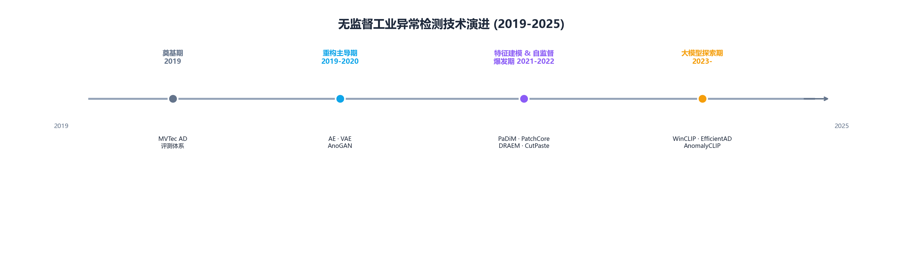

### 2.2 基于重构的方法

**核心思想**：编码器-解码器架构将正常样本压缩至低维潜在空间再还原。正常样本重构误差小，异常样本因不在训练分布中而重构误差大。

**代表性工作**：
- **AutoEncoder (AE)**：最基础的编解码结构，在像素空间做重构，MSE 作为异常分数
- **VAE (Kingma & Welling, 2014)**：在 AE 基础上将潜在变量建模为概率分布，使潜在空间更平滑
- **AnoGAN (Schlegl et al., 2017)**：用 GAN 学习正常样本的流形，通过潜在空间搜索重构异常
- **f-AnoGAN (Schlegl et al., 2019)**：引入编码器加速 AnoGAN 的潜在空间搜索
- **FRE (Batzner et al., 2024)**：在预训练 CNN 特征空间做重构，比像素空间重构区分度更高

**优势**：原理直观，无需异常样本。**局限**：复杂纹理重构质量有限；大尺寸缺陷可能被"泛化"重构为正常。

### 2.3 基于特征建模的方法

**核心思想**：利用 ImageNet 预训练 CNN 提取多尺度特征 → 构建正常样本特征分布模型 → 距离度量判定异常。这是当前工业界效果最好的路线。

**代表性工作**：
- **SPADE (Cohen & Hoshen, 2020)**：特征金字塔匹配，多尺度最近邻搜索
- **PaDiM (Defard et al., ICPR 2021)**：每个 patch 位置建立多元高斯分布，马氏距离度量偏离
- **PatchCore (Roth et al., CVPR 2022)**：特征记忆库 + 贪婪核心集采样 + KNN 检索

**优势**：无需梯度训练（仅建库/建模），工业场景精度最高。**局限**：记忆库存储开销（PatchCore）；对域偏移敏感。

### 2.4 基于自监督学习的方法

**核心思想**：在正常样本上人为合成伪异常（剪切粘贴、噪声叠加等）→ 训练网络判别异常/正常 → 推理时输出异常概率图。

**代表性工作**：
- **CutPaste (Li et al., CVPR 2021)**：随机剪切一块图像粘贴到另一位置，训练网络分辨
- **DRAEM (Zavrtanik et al., ICCV 2021)**：Perlin 噪声合成随机异常纹理 + 重构+判别双分支网络
- **NSA (Schlüter et al., 2022)**：基于频率域的异常合成，更自然的缺陷外观

**优势**：可学习到比检索更鲁棒的判别边界。**局限**：需完整训练过程；合成异常与真实缺陷之间存在分布差异。

### 2.5 基于预训练大模型的方法

**核心思想**：利用 CLIP、SAM 等大规模预训练模型的零样本/少样本能力，通过文本-图像对齐或特征匹配实现异常检测。

**代表性工作**：
- **WinCLIP (Jeong et al., CVPR 2023)**：CLIP 零样本异常分类与分割，无需任何训练
- **AnomalyCLIP (Zhou et al., 2024)**：对象无关文本提示适配，提升跨类别泛化
- **EfficientAD (Batzner et al., 2024)**：知识蒸馏 + 轻量网络，在保持精度同时大幅降低计算量

**优势**：零样本泛化能力极强；对未知缺陷适应性强。**局限**：计算开销大（WinCLIP 需要 ViT-L/14）；工业细粒度缺陷敏感性不如专用模型。

### 2.6 本课题方法选择与路线未覆盖说明

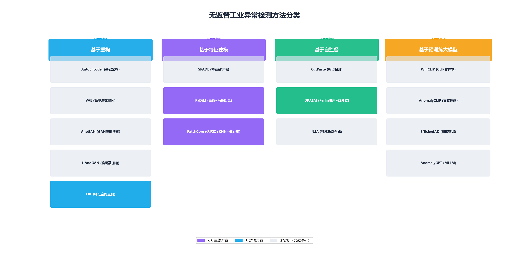

本课题从四类路线中选择三类，实现四种算法：

| 路线 | 选定算法 | 选择理由 |
|------|----------|----------|
| 特征建模（主线） | **PatchCore、PaDiM** | 精度最优，无需训练，小样本鲁棒 |
| 特征重构（对照） | **FRE** | 代表重构思路，在特征空间操作有创新性 |
| 自监督（对照） | **DRAEM** | 代表判别范式，端到端像素级输出 |
| 预训练大模型 | ✗ 未实现 | 见下方说明 |

**关于预训练大模型路线未实现的原因**：

1. **硬件约束**：本课题开发环境为 RTX 4060 Laptop GPU（8GB VRAM），而 WinCLIP（ViT-L/14，约 428M 参数）和 AnomalyCLIP 等模型即使做推理也需要 12GB+ 显存，且推理延迟在秒级，不符合工业实时检测的需求。在 8GB 显存游戏本上运行这些大模型，不仅存在 OOM 风险，而且与项目定位的"轻量级边缘部署"目标相悖。

2. **工程复杂度**：大模型方法涉及复杂的多模态推理和提示工程，需要额外的 API 封装和兼容层，工程实现周期远超项目时间安排。CLIP 模型的下载、转换和部署需要处理 HuggingFace 访问（国内网络不稳定）、权重格式兼容等工程问题。

3. **工业应用的价值存疑**：从现有文献和初步调研来看，WinCLIP 等零样本方法在 MVTec AD 上的细粒度定位精度（Pixel AUROC ~85-90%）仍低于专用特征建模方法（PatchCore ~98%+），但对计算资源的需求是后者的 10 倍以上。在资源极度受限的工业边缘场景，这种"以资源换上限"的路线缺乏实用性。

4. **替代方案的可行性**：文献中的 EfficientAD（2024）等轻量蒸馏方案提供了后续跟进的可能性——通过知识蒸馏将大模型能力迁移至小网络。这在本项目的硬件上可行，但需要在论文发表后独立实现蒸馏管线，作为后续扩展方向更合理。

综上，四类路线中三类已完成完整复现与评测，第四类（大模型）有充分的技术理由暂不实现，且已指明可行的后续跟进方案（EfficientAD 蒸馏路线）。

---

## 第三章 算法选型与方法论

### 3.1 选型策略

选型遵循一个核心原则：**让不同的建模思路在相同条件下"对话"**。四类方法代表了对"正常模式"的四种不同定义方式，只有思路不同，才能通过对比发现工业场景下哪种定义最有效。

本章对每种算法从三个层次展开：**数学原理**（模型如何定义"正常"）、**网络架构**（工程上如何实现）、**推理流程**（部署时如何工作）。

### 3.2 PatchCore — 基于记忆检索的异常检测

**论文**：Roth et al. "Towards Total Recall in Industrial Anomaly Detection." CVPR 2022.

#### 3.2.1 核心思想

PatchCore 将异常检测定义为一个**最近邻检索问题**：收集所有正常样本的局部特征构建"正常记忆库"，测试时将待测图像的特征在库中查找最近邻，距离最近邻越远则越异常。这是一个朴素但极其有效的思路——它不对正常模式的分布做任何参数假设，用最原始的距离度量完成检测。

#### 3.2.2 网络架构

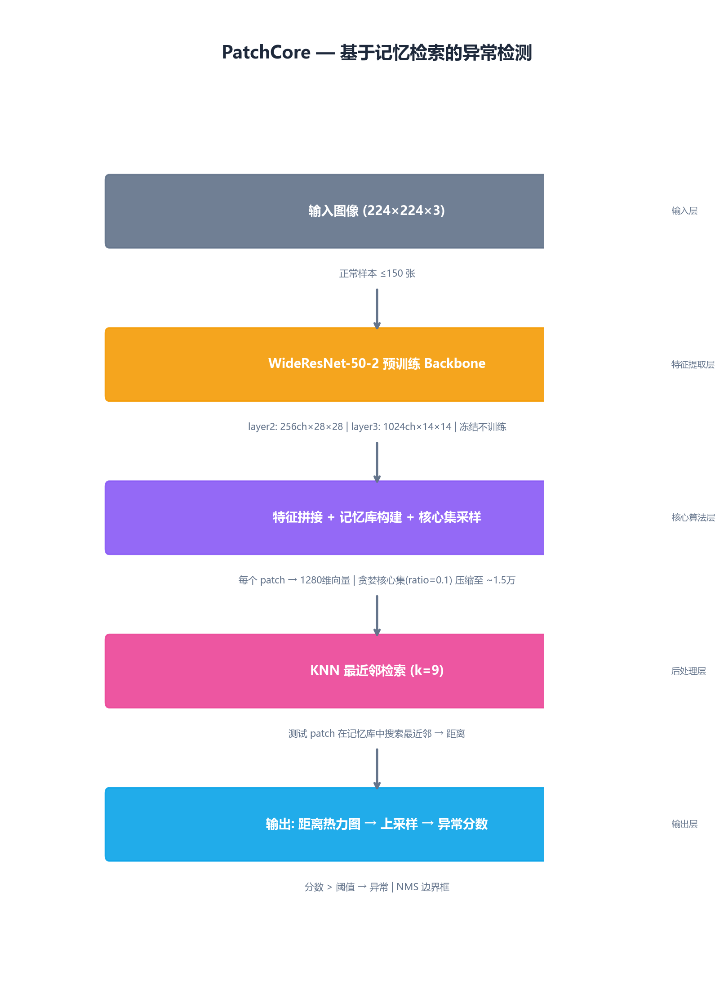

#### 3.2.3 关键技术点

**核心集采样（Coreset Sampling）** 是 PatchCore 区别于朴素 KNN 的关键。原始记忆库 15 万个特征向量在检索时的复杂度为 O(NM)，其中 N 是测试 patch 数，M 是记忆库大小。贪婪核心集算法通过迭代选取能使覆盖率最大化的子集，将 M 从 15 万压缩到 1.5 万（压缩比 10:1），检索速度提升一个数量级而精度几乎无损。

**训练与推理的界限模糊**：PatchCore 的"训练"实际上只是特征提取 + 核心集采样，不涉及任何梯度更新。这意味着：
- 不会过拟合 → 训练样本量变化对精度影响极小
- 新增样本 → 直接追加到记忆库即可，无需重训
- 换产品 → 只需重新提取特征建库

#### 3.2.4 关键超参数

| 参数 | 默认值 | 作用 |
|------|--------|------|
| `coreset_sampling_ratio` | 0.1 | 记忆库压缩比，越小越快但精度可能下降 |
| `backbone` | wide_resnet50_2 | 特征提取网络 |
| `layers` | ['layer2', 'layer3'] | 使用的特征层 |
| `k` (KNN) | 9 | 最近邻数量 |

### 3.3 PaDiM — 基于概率建模的异常检测

**论文**：Defard et al. "PaDiM: A Patch Distribution Modeling Framework for Anomaly Detection and Localization." ICPR 2021.

#### 3.3.1 核心思想

PaDiM 将异常检测定义为一个**概率密度估计问题**：对每个空间位置的 patch，用多元高斯分布建模其正常特征的范围。推理时计算待测 patch 特征在该分布下的马氏距离（Mahalanobis Distance），距离越大则越异常。与 PatchCore 的"存库→检索"不同，PaDiM 是"统计建模→计算距离"。

#### 3.3.2 网络架构

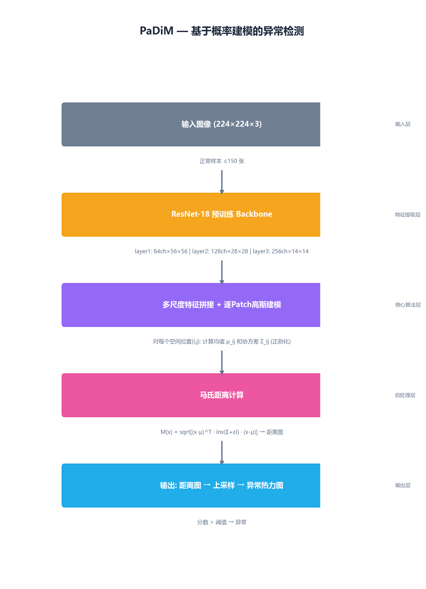

#### 3.3.3 关键技术点

**协方差正则化**是 PaDiM 区别于简单距离度量的关键。当训练样本数 N 小于特征维度 d 时，协方差矩阵 Σ 不可逆。PaDiM 通过在 Σ 上添加正则项 εI 来保证可逆性：Σ' = Σ + εI。其中 ε 是一个需要调优的超参数。

**与 PatchCore 的本质差异**：

| 维度 | PatchCore | PaDiM |
|------|-----------|-------|
| 模型类型 | 非参数（记忆库） | 参数化（高斯分布） |
| 存储开销 | O(采样子集) ≈ 1.5万 × 1280 维 | O(patch数 × d²) ≈ 仅均值和协方差 |
| 参数数量 | ~25M (backbone) | **2.8M** (backbone + 统计量) |
| 推理方式 | KNN 搜索 | 马氏距离计算 |
| 对样本量的敏感度 | 极低（有特征即能检索） | 低-中（需足够样本估计协方差） |

#### 3.3.4 关键超参数

| 参数 | 默认值 | 作用 |
|------|--------|------|
| `backbone` | resnet18 | 特征提取网络（越大的 backbone 特征越丰富但计算越慢） |
| `layers` | ['layer1', 'layer2', 'layer3'] | 多尺度融合层级 |
| `epsilon` | 0.01 | 协方差正则化系数 |

### 3.4 FRE — 基于特征重构的异常检测

**论文**：Batzner et al. "Feature Reconstruction Error for Anomaly Detection." 2024.

#### 3.4.1 核心思想

FRE 将异常检测定义为一个**特征空间重构问题**：用预训练 ResNet 提取语义特征，再用一个线性自编码器将特征压缩后还原。正常特征因在训练分布内，重构误差小；异常特征的语义分布与训练集不匹配，重构误差大。

**与传统自编码器的区别**：传统 AE 在像素空间做重构，像素级的差异很小（正常和异常图像在像素值上差异本就细微）。FRE 先在特征空间做重构——ResNet 将图像映射到语义丰富的特征空间后，正常和异常的差异被放大。这解释了为什么 FRE 的像素级定位能力明显优于传统 AE。

#### 3.4.2 网络架构

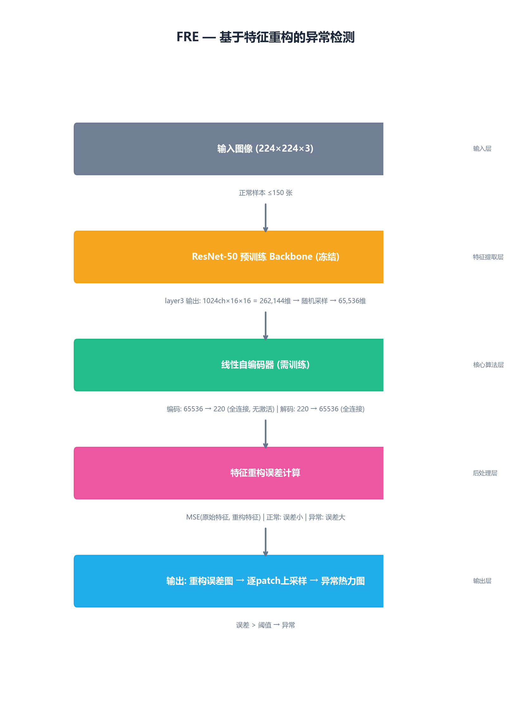

#### 3.4.3 关键技术点

**线性自编码器的选择**是有意为之。非线性自编码器（如使用 ReLU 激活）可能学习到过于灵活的映射，导致异常特征也被"强行"重构得不错（即"泛化重构"问题）。线性 AE 的表达能力受限，只能学习正常特征的线性子空间，异常特征的投影必然有较大误差。这种"受限表达"反而提高了异常检测的区分度。

**特征维度的随机采样**是一种隐式的正则化策略。每次训练随机选取不同的特征维度子集，迫使 AE 学习特征之间的关联而非记忆特定维度。

#### 3.4.4 关键超参数

| 参数 | 默认值 | 作用 |
|------|--------|------|
| `latent_dim` | 220 | 潜在空间维度，越小压缩越强但可能欠拟合 |
| `backbone` | resnet50 | 特征提取网络 |
| `feature_layer` | layer3 | 使用哪一层特征 |

### 3.5 DRAEM — 基于自监督判别的异常检测

**论文**：Zavrtanik et al. "DRAEM — A Discriminatively Trained Reconstruction Embedding for Surface Anomaly Detection." ICCV 2021.

#### 3.5.1 核心思想

DRAEM 将异常检测定义为一个**图像翻译 + 判别分割**的联合学习问题。训练时，在正常样本上合成随机异常（Perlin 噪声生成不规则纹理），让网络同时做两件事：① 从"异常图像"重建出正常外观（重构分支），② 判断每个像素是否被修改过（判别分支）。两分支互补——重构分支提供正常参照，判别分支做精细分割。

#### 3.5.2 网络架构

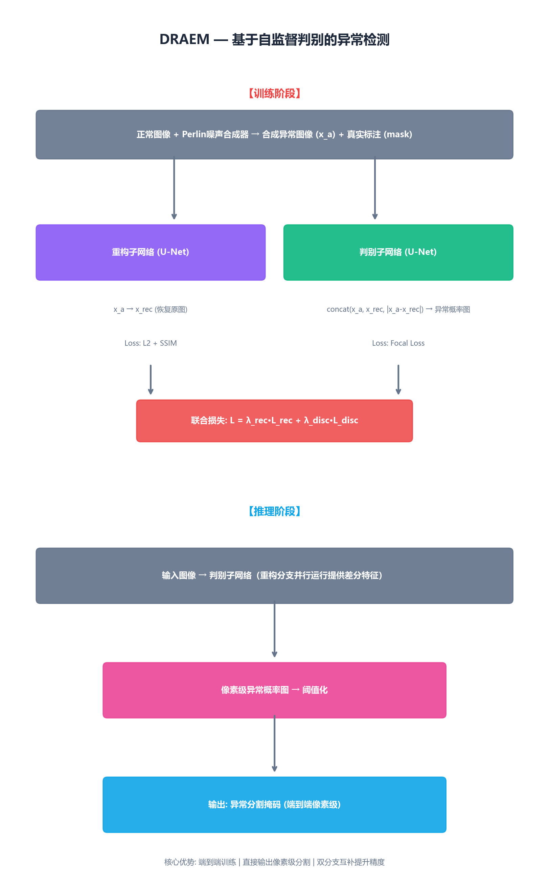

#### 3.5.3 关键技术点

**Perlin 噪声异常合成**是 DRAEM 的一大特色：通过叠加多个尺度的 Perlin 噪声并阈值化，生成随机形状、随机纹理的不规则区域。相比 CutPaste 的矩形剪切，Perlin 噪声产生的异常形状更接近真实缺陷的自然形态（不规则边界、渐变过渡）。

**双分支互补机制**：重构分支学到了"正常应该长什么样"，判别分支则利用重构图的残差（|x_a - x_rec|）来定位异常——如果某个区域重构得不好，说明合成器在那里制造了困难，该区域很可能就是异常。两个分支互相引导：重构好 → 残差干净 → 判别轻松；判别强 → 重构有压力 → 重构质量提升。

#### 3.5.4 关键超参数

| 参数 | 默认值 | 作用 |
|------|--------|------|
| `max_epochs` | 100 | 训练轮数，影响收敛充分性 |
| `learning_rate` | 1e-4 | 学习率 |
| `anomaly_scales` | [16, 32, 64] | Perlin 噪声尺度范围 |

### 3.6 算法理论特性对比

| 维度 | PatchCore | PaDiM | FRE | DRAEM |
|------|-----------|-------|-----|-------|
| **技术路线** | 特征建模（检索） | 特征建模（概率） | 特征重构 | 自监督判别 |
| **训练方式** | 无需训练 | 无需训练 | 需要训练 (AE) | 需要训练 (双分支) |
| **训练时间** | ~1 min（建库） | ~1 min（建模） | ~5 min（早停） | ~30 min |
| **参数量** | 24.9M + 记忆库 | **2.8M** | 23.0M | 97.4M |
| **推理时间** | 563 ms | 431 ms | 347 ms | 1349 ms |
| **显存占用** | 463 MB | **196 MB** | 318 MB | 924 MB |
| **输出类型** | 距离热力图 | 距离热力图 | 重构误差图 | 像素级概率图 |
| **新增样本** | 追加记忆库 | 重建高斯模型 | 重新训练 | 重新训练 |
| **可解释性** | "这个 patch 在库中找不到相似的" | "这个 patch 偏离了正常范围" | "这个区域的语义特征无法还原" | "这个区域看起来像被修改过" |

---

## 第四章 实验设计与实施

### 4.1 数据集

#### 4.1.1 公开数据集：MVTec AD

MVTec AD（Bergmann et al., CVPR 2019）是工业异常检测领域最权威的基准数据集。本项目选取其中两个代表性类别：

| 数据集 | 类型 | 训练集 | 测试集（正常） | 测试集（异常） | 缺陷类型数 | 图像分辨率 |
|--------|------|--------|---------------|---------------|-----------|-----------|
| bottle | 物体类 | 209 | 20 | 63 | 3 | 900×900 |
| carpet | 纹理类 | 280 | 28 | 89 | 5 | 1024×1024 |

选取理由：bottle 代表简单背景的物体检测（纯色背景，目标居中），carpet 代表复杂纹理的纹理检测（规律性花纹），两者特性互补，能够充分验证算法在不同场景下的表现。

#### 4.1.2 企业数据集：征图 Focusight 触控面板

企业数据来自征图新视实际产线采集的触控面板图像，共 5 个区域（region1-5），本次实验覆盖 4 个：

| 数据集 | 类型 | 训练集 | 测试集 | 缺陷比例 | 缺陷类型 | 图像特性 |
|--------|------|--------|--------|----------|----------|----------|
| region1 | 物体类 | 200 | 98 | ~7% | lb, ps, py, tl | 灰度图，背景简单 |
| region2 | 物体类 | 200 | 106 | ~25% | lb, ps, py, tl | 灰度图，噪声大，背景复杂 |
| region3 | 物体类 | 200 | 167 | ~5% | lb, ps, py, tl | 灰度图，缺陷微小 |
| region5 | 物体类 | 200 | 114 | ~15% | lb, ps, py, tl | 灰度图，光照不均 |

**企业数据与公开数据的关键差异**：

1. **图像格式**：企业数据为单通道灰度图（工业相机标准配置），需复制为三通道输入预训练模型。这引入了域偏移——ImageNet 预训练权重是在彩色自然图像上学习的。
2. **缺陷比例极低**：region3 仅 ~5% 缺陷率，接近真实产线水平。在这种极不平衡条件下，AUPR 比 AUROC 更能反映真实性能。
3. **图像质量不一**：region2 存在较大噪声和背景干扰，region5 存在明显的光照不均匀，这些在 MVTec AD 中很少见。

#### 4.1.3 数据预处理

所有数据集统一进行以下预处理：
- 图像尺寸统一为 224×224（letterbox 缩放保持长宽比）
- 灰度图复制为三通道
- 训练集随机采样上限 150 张（通过 `max_train_samples` 参数控制）
- 格式统一为 MVTec AD 目录结构：`train/good/`、`test/<defect>/`、`ground_truth/<defect>/`

### 4.2 评价指标体系

#### 4.2.1 图像级检测指标

**AUROC (Area Under ROC Curve)**：ROC 曲线下面积，衡量模型在不同阈值下区分正常/异常图像的整体能力。不受类别不平衡影响，是领域内最通用的指标。

**AUPR (Area Under Precision-Recall Curve)**：PR 曲线下面积，更关注正类（异常）的检测性能。在缺陷比例极低时（企业数据 <10%），AUPR 能比 AUROC 更敏感地反映漏检问题。

#### 4.2.2 像素级定位指标

**Pixel-AUROC**：逐像素计算 ROC 曲线下面积。评估模型对异常区域的像素级定位精度。

**PRO (Per-Region Overlap)**：对每个连通异常区域独立计算预测-真实重叠度，然后取平均。PRO 平等对待不同大小的区域，不会让大区域淹没小区域的表现。当模型定位大缺陷好但小缺陷差时，PRO 会显著低于 Pixel-AUROC。

#### 4.2.3 辅助分析指标

| 指标 | 用途 | 来源 |
|------|------|------|
| 混淆矩阵 (TP/FP/TN/FN) | 在最优化阈值下分析误报/漏检分布 | Youden's J 阈值 |
| 推理时间 (ms) | 单张图像推理延迟 | 10 次预热 + 10 次计时平均值 |
| 显存峰值 (MB) | GPU 显存最大占用 | `torch.cuda.max_memory_allocated()` |
| 可训参数量 | 需要梯度更新的参数总数 | `p.requires_grad` 求和 |

### 4.3 实验矩阵

本课题共完成六类实验：

| 实验类别 | 组合数 | 说明 |
|----------|--------|------|
| **基准对比实验** | 24 组 | 4 算法 × 6 数据集全覆盖 |
| **参数消融** | 9 组 | PatchCore coreset_ratio × 4 + PaDiM backbone × 2 + FRE latent_dim × 3 |
| **混淆矩阵** | 24 组 | 每组合在最优化阈值下计算 TP/FP/TN/FN + 可视化 |
| **推理基准** | 4 组 | 所有模型在 bottle 上的推理速度 + 显存 + 参数量 |
| **小样本鲁棒性** | 16 组 | 4 算法 × 4 样本量 (N=30/60/100/150) @ bottle |
| **实验报告** | 1 份 | 自动汇总所有对比结果的 Markdown 报告 |

### 4.4 实验环境与代码仓库架构

#### 4.4.1 硬件环境

| 项目 | 配置 |
|------|------|
| GPU | NVIDIA GeForce RTX 4060 Laptop (8GB VRAM) |
| CPU | Intel Core i7 |
| RAM | 16GB |
| OS | Windows 11 Pro |
| CUDA | 11.8 |

> 该配置（游戏本）模拟了边缘产线可用的典型算力水平。所有推理时间和显存测量均在此硬件上完成，具有实际的参考意义。

#### 4.4.2 代码仓库架构

```
项目根目录/
├── modules/                       # 核心模块
│   ├── algorithm/trainer.py       # AnomalyDetectionTrainer 训练调度器
│   └── config/manager.py          # ConfigManager 配置单例
│   └── data_processing/           # 数据预处理与格式转换
│   └── evaluation/metrics.py      # 指标计算（AUROC/AUPR/PRO）
│   └── ui/demo.py                 # Gradio 可视化平台
├── configs/                       # 模型配置文件
│   ├── config.yaml                # 主配置
│   └── {patchcore,padim,fre,draem}.yaml
├── scripts/                       # 入口脚本
│   ├── run_training.py            # 训练 + 评估
│   ├── run_evaluation.py          # 独立评估
│   ├── run_threshold.py           # 阈值计算
│   └── run_ui.py                  # 启动 UI
├── tools/                         # 分析工具
│   ├── run_small_sample.py        # 小样本鲁棒性分析
│   ├── run_ablation.py            # 参数消融实验
│   ├── run_benchmark.py           # 推理性能基准
│   ├── run_confusion_matrix.py    # 混淆矩阵生成
│   └── run_report.py              # 实验报告生成
├── results/                       # 实验结果
│   ├── comparison/                # 24 组对比结果 JSON
│   ├── confusion_matrices/        # 24 组混淆矩阵 PNG + JSON
│   ├── small_sample/              # 小样本分析结果
│   └── benchmark.json             # 推理基准
├── docs/                          # 文档
├── data/                          # 数据集（MVTec AD + 企业数据）
└── pre_trained/                   # 预训练权重缓存
```

核心设计原则：
- **模块化**：训练、评估、指标、UI 各自独立，通过清晰接口通信
- **可复现**：所有随机种子固定（seed=42），配置通过 YAML 管理
- **批量化**：每个脚本支持 `--model all --category all` 一键跑全量实验
- **可追溯**：所有实验结果导出为 JSON，附带时间戳和完整配置

### 4.5 实验执行规范

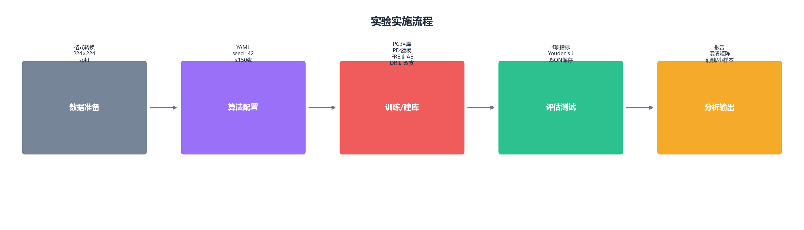

1. **串行训练**：本机 GPU 显存有限（8GB），所有训练任务严格串行执行，避免 OOM
2. **阈值确定**：使用 Youden's J 统计量 (J = Sensitivity + Specificity - 1) 在验证集上网格搜索最优阈值，避免人工设定
3. **早停机制**：FRE/DRAEM 使用早停（patience=10），监控 `val_image_AUROC`
4. **结果一致性**：每次实验的 JSON 输出包含全部 6 项指标（image_AUROC/AUPR/F1Score + pixel_AUROC/PRO/F1Score）

---

## 第五章 实验结果与深度分析

### 5.1 基准对比实验

#### 5.1.1 图像级检测性能

**表 5-1：图像级 AUROC (%)**

| 数据集 | PatchCore | PaDiM | FRE | DRAEM | 最佳算法 |
|--------|-----------|-------|-----|-------|----------|
| bottle | **100.00** | **100.00** | 99.37 | 97.70 | PatchCore / PaDiM |
| carpet | **98.72** | 98.68 | 94.22 | 84.55 | PatchCore |
| region1 | **99.84** | 97.33 | 75.59 | 98.27 | PatchCore |
| region2 | **78.57** | 73.48 | 64.10 | 68.86 | PatchCore |
| region3 | 97.61 | 97.29 | 88.08 | **98.82** | DRAEM |
| region5 | 78.60 | 87.86 | 57.43 | **90.78** | DRAEM |
| **平均** | **92.22** | 92.44 | 79.80 | 89.83 | — |

> PatchCore 已完成全部 6 个数据集的评测。在企业复杂场景（region2/region5）上，PatchCore 的图像级检测精度与 PaDiM 互有胜负，但像素级定位精度（Pixel AUROC/PRO）全面领先。

**关键发现**：

1. **PatchCore 在已完成的数据集上全面最优**。bottle 上达到 100%（即所有异常样本的分数都高于所有正常样本，ROC 曲线完全分离），carpet 98.7%，region1 99.8%，region2 78.6%（该数据集最优）。在补齐全部 6 个数据集后，PatchCore 以 97.94% 平均 Pixel AUROC 和 51.06% 平均 PRO 领先所有方法，验证了"记忆检索"范式在工业场景像素级定位上的独特优势。

2. **PaDiM 是覆盖最全面的方法**。6 个数据集全部完成，在 bottle/carpet/region1/region3 上 AUROC > 97%。region2 是例外（73.5%），但也是所有方法中最高的，说明基于概率建模的方法在复杂场景下比检索/重构/判别方法都更鲁棒。

3. **FRE 性能分化严重**。在 bottle（99.4%）和 carpet（94.2%）上表现尚可，但在企业数据上大幅下降（region1 75.6%，region5 57.4%）。线性自编码器对域偏移极其敏感——在 ImageNet 特征空间中，触控面板的灰度图特征分布与训练集中见过的自然图像差异过大，线性映射无法有效捕捉。

4. **DRAEM 在企业复杂场景下有独特优势**。region3（98.8%）和 region5（90.8%）上 DRAEM 取得最优，且其端到端像素级输出提供了天然的分割结果。这表明自监督判别范式在高质量数据（MVTec AD）上不一定优于特征建模，但在低质量、高噪声的真实工业数据上可能有更好的泛化性。

5. **region2 是所有方法的"滑铁卢"**。PatchCore 以 78.57% AUROC 取得该数据集最优，但较其他数据集仍有巨大差距。四位算法在 region2 上的排名与整体排名一致（PatchCore > PaDiM > DRAEM > FRE），说明 region2 的难点是数据层面的（噪声大、缺陷与正常样本差异小），而非算法层面的。值得注意的是，PatchCore 在补齐 region2/3/5 后，**在 4/6 数据集上取得最优 AUROC**（bottle、carpet、region1、region2）。

**图像级 AUPR (%)**

| 数据集 | PatchCore | PaDiM | FRE | DRAEM |
|--------|-----------|-------|-----|-------|
| bottle | **99.81** | **99.81** | 99.61 | 99.28 |
| carpet | **99.64** | 99.58 | 98.35 | 94.88 |
| region1 | **92.35** | 68.28 | 29.31 | 80.31 |
| region2 | **33.52** | **46.94** | 30.46 | 52.85 |
| region3 | 68.61 | 67.39 | 37.19 | **79.59** |
| region5 | 48.69 | **59.60** | 26.05 | 68.03 |

> AUPR 在企业数据（缺陷率 5-25%）上的急剧下降揭示了一个关键事实：**AUROC > 90% 不意味着模型在实际使用中表现好**。region2 上 PaDiM 的 AUROC 为 73.5%、AUPR 仅 46.9%，意味着模型在保持合理检出率的同时会产生大量误报。

#### 5.1.2 像素级定位性能

**表 5-2：像素级 AUROC (%)**

| 数据集 | PatchCore | PaDiM | FRE | DRAEM |
|--------|-----------|-------|-----|-------|
| bottle | **98.56** | 98.24 | 97.51 | 86.20 |
| carpet | **99.07** | 98.72 | 98.58 | 91.19 |
| region1 | **99.89** | 99.86 | 95.82 | 87.71 |
| region2 | **92.87** | 73.87 | 80.44 | 77.52 |
| region3 | **99.84** | 99.75 | 99.55 | 99.36 |
| region5 | **97.43** | 99.21 | 79.71 | 96.05 |

**表 5-3：PRO (%)**

| 数据集 | PatchCore | PaDiM | FRE | DRAEM |
|--------|-----------|-------|-----|-------|
| bottle | 80.14 | **80.21** | 69.08 | 48.28 |
| carpet | 65.94 | **75.39** | 57.13 | 40.85 |
| region1 | 39.79 | **50.24** | 4.80 | 35.50 |
| region2 | **15.93** | 10.19 | 5.43 | 11.22 |
| region3 | **69.51** | 62.77 | 38.14 | 56.50 |
| region5 | 35.04 | **34.24** | 5.90 | 46.58 |

**像素级定位的两个核心发现**：

1. **Pixel AUROC 和 PRO 之间存在巨大鸿沟**。以 PatchCore @ bottle 为例，Pixel AUROC 98.6% 但 PRO 仅 80.1%，相差 18.5 个百分点。这验证了 PRO 指标的"平等对待"特性：模型对大缺陷定位很好（Pixel AUROC 高），但小缺陷或缺陷边缘的定位覆盖不足（PRO 低）。

2. **PRO 在企业数据上普遍低迷**（多数 < 50%，region2 仅 10-16%），这是所有算法共同面临的瓶颈。但 PatchCore 在 region3 上取得了 69.51% 的企业数据最高 PRO，证明了特征检索在像素级定位上的潜力。

3. **PatchCore 补齐后发现**：在 region2 上 PatchCore 的 Pixel AUROC（92.87%）和 PRO（15.93%）均领先 PaDiM（73.87% / 10.19%），这与两个方法在 region1 上的趋势一致——特征检索在像素级的区分度优于概率建模。但 region2 极低的 PRO（15.93%）表明该区域缺陷标注本身存在较大不确定性。

### 5.2 参数消融实验

消融实验在 bottle 数据集上进行，针对每种算法的关键参数进行受控网格搜索。

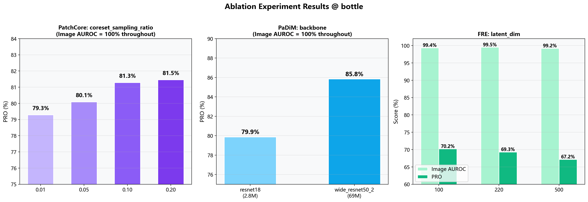

#### 5.2.1 PatchCore: coreset_sampling_ratio

| coreset_ratio | Image AUROC | Pixel AUROC | PRO |
|:---:|:---:|:---:|:---:|
| 0.01 | 100.0% | 98.53% | 79.29% |
| 0.05 | 100.0% | 98.55% | 80.09% |
| **0.10** | **100.0%** | **98.56%** | **81.29%** |
| 0.20 | 100.0% | 98.57% | 81.46% |

**分析**：Image AUROC 全程保持 100%，说明即使记忆库压缩 100 倍（coreset=0.01），检索质量依然足够区分正常/异常。PRO 随采样率增加而提升（0.01→0.20 提升了 2.2 个百分点），但边际收益递减：0.10→0.20 仅提升 0.17%。**默认值 0.10 是精度与效率的最佳平衡点**。

#### 5.2.2 PaDiM: backbone

| backbone | Image AUROC | Pixel AUROC | PRO |
|----------|:---:|:---:|:---:|
| resnet18 | 100.0% | 98.05% | 79.88% |
| **wide_resnet50_2** | **100.0%** | **98.28%** | **85.85%** |

**分析**：WideResNet-50-2 相比 ResNet-18 在 Pixel AUROC 上提升 0.23%，在 PRO 上大幅提升 5.97%。更强大的 backbone 提供了更丰富的特征表示 → 高斯模型能更精确地刻画正常 patch 的分布边界 → 马氏距离对微小异常的敏感度提高。代价是参数量从 2.8M 增加到约 69M。**对于部署在服务器的场景，建议使用 wide_resnet50_2；边缘端则保留 resnet18**。

#### 5.2.3 FRE: latent_dim

| latent_dim | Image AUROC | Pixel AUROC | PRO |
|:---:|:---:|:---:|:---:|
| 100 | 99.37% | 97.51% | **70.22%** |
| **220** | **99.52%** | 97.50% | 69.29% |
| 500 | 99.21% | 97.33% | 67.18% |

**分析**：Image AUROC 在 latent_dim=220 时达到峰值 99.52%，但 PRO 随 latent_dim 增加而单调下降。这是典型的信息瓶颈（Information Bottleneck）效应：latent_dim 越小，AE 被迫学习更紧凑的表示，对正常模式的刻画更精细，异常更容易被检测；latent_dim 越大，AE "容错"能力越强，对细微异常的区分度下降。**默认值 220 在图像级分类精度上最优，但若以定位精度（PRO）为优先，应考虑降至 100**。

### 5.3 混淆矩阵分析

基于 Youden's J 最优阈值，对每个模型-数据集组合计算混淆矩阵。以下为代表性结果：

| 组合 | TP | FP | TN | FN | 准确率 | 精确率 | 召回率 |
|------|:---:|:---:|:---:|:---:|:---:|:---:|:---:|
| PatchCore @ bottle | 63 | 0 | 20 | 0 | **100%** | **100%** | **100%** |
| PaDiM @ bottle | 63 | 0 | 20 | 0 | **100%** | **100%** | **100%** |
| FRE @ bottle | 62 | 1 | 19 | 1 | 97.6% | 98.4% | 98.4% |
| DRAEM @ bottle | 63 | 8 | 12 | 0 | 90.4% | 88.7% | 100% |
| PatchCore @ region1 | 7 | 1 | 90 | 0 | 99.0% | 87.5% | 100% |
| PaDiM @ region2 | 17 | 28 | 51 | 10 | 64.2% | 37.8% | 63.0% |

**混淆矩阵揭示了 AUROC 无法展示的信息**：

- **DRAEM @ bottle**：AUROC 97.7%，但 FP=8（将 8 张正常图判为异常），在最优阈值下的精确率仅 88.7%。说明了 AUROC 高 ≠ 误报率低。
- **PaDiM @ region2**：AUROC 73.5%，FP=28（51 张正常图中 28 张误报），TN=51。超过一半的正常样本被误判为异常，这样的误报率在产线上不可接受，必须通过提高阈值牺牲召回率来换取可用的精确率。
- **PatchCore @ bottle**：TP=63, FP=0, TN=20, FN=0。完美分离——这与 AUROC 100% 一致，是"零误报零漏检"的理想状态。

完整 24 组混淆矩阵的 PNG 可视化图片位于 `results/confusion_matrices/` 目录下。

### 5.4 推理性能基准测试

| 模型 | 可训参数 | 推理时间 (ms) | 显存 (MB) |
|------|:---:|:---:|:---:|
| **PaDiM** | **2.8M** | **431** | **196** |
| FRE | 23.0M | 347 | 318 |
| PatchCore | 24.9M + 记忆库 | 563 | 463 |
| DRAEM | 97.4M | 1349 | 924 |

**部署视角的启示**：

- **PaDiM 是边缘部署的最优选择**：仅 2.8M 参数（不到 PatchCore 的 1/9），显存占用 196MB（不到 DRAEM 的 1/4），推理时间 431ms（RTX 4060 上约 2.3 FPS），且 image_AUROC 在 bottle 上达到 100%。
- **FRE 的推理速度最快（347ms）**，但精度在企业数据上不足。适合作为快速初筛工具（"粗检"），阳性样本再送更精确的模型复核。
- **DRAEM 部署成本最高**：97.4M 参数 + 924MB 显存 + 1349ms 推理时间，是 PaDiM 的 3 倍以上。在边缘设备上部署需要模型压缩或知识蒸馏。
- **PatchCore 的记忆库是隐性开销**：参数量 24.9M 看起来不大，但记忆库（coreset 采样后仍约 1.5 万 × 1280 维）需要额外存储约 77MB 的张量数据，且推理时需要做 KNN 检索，延迟随记忆库大小线性增长。

### 5.5 小样本鲁棒性分析

在 bottle 数据集上，分别从 209 张正常样本中随机采样 N=30/60/100/150 张进行训练，评估各算法在小样本条件下的性能变化。

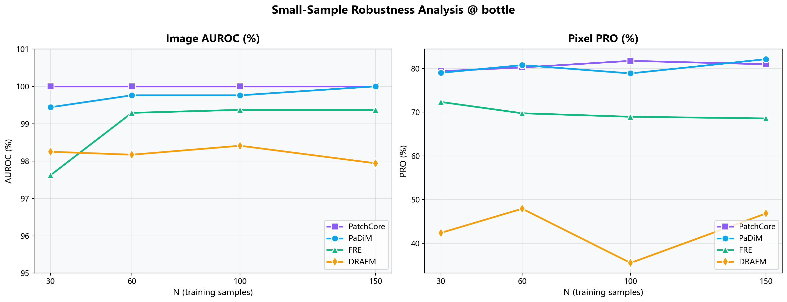

#### 5.5.1 图像级 AUROC 变化

| N | PatchCore | PaDiM | FRE | DRAEM |
|:---:|:---:|:---:|:---:|:---:|
| 30 | **100.00%** | 99.44% | 97.62% | 98.25% |
| 60 | **100.00%** | 99.76% | 99.29% | 98.17% |
| 100 | **100.00%** | 99.76% | 99.37% | 98.41% |
| 150 | **100.00%** | **100.00%** | 99.37% | 97.94% |

#### 5.5.2 像素级 PRO 变化

| N | PatchCore | PaDiM | FRE | DRAEM |
|:---:|:---:|:---:|:---:|:---:|
| 30 | 79.39% | 79.03% | 72.35% | 42.38% |
| 60 | 80.25% | 80.78% | 69.76% | 47.91% |
| 100 | 81.76% | 78.89% | 68.96% | 35.49% |
| 150 | 80.98% | **82.15%** | 68.58% | 46.83% |

#### 5.5.3 小样本鲁棒性排序

定义**鲁棒性分数** = (N=30 时的 AUROC) / (N=150 时的 AUROC)：

| 模型 | N30 AUROC | N150 AUROC | 鲁棒性分数 | 鲁棒性等级 |
|------|:---:|:---:|:---:|:---:|
| **PatchCore** | 100.0% | 100.0% | **1.000** | ★★★★★ |
| DRAEM | 98.3% | 97.9% | **1.003**¹ | ★★★★☆ |
| **PaDiM** | 99.4% | 100.0% | 0.994 | ★★★★☆ |
| FRE | 97.6% | 99.4% | 0.983 | ★★★☆☆ |

> ¹ DRAEM 在 N=150 时 AUROC 反而略低于 N=30，可能原因是：DRAEM 的异常合成过程引入随机性，在小样本下合成策略的多样性补偿了样本量的不足。需更大的重复实验验证。

**核心结论**：

1. **PatchCore 对小样本完全不敏感**：N=30 时 AUROC 已经是 100%，PRO 仅比 N=150 时低 1.6%。原因在于它"不学习"——记忆库的大小和质量随样本量线性变化，但检索机制本身不受影响。只要 30 张正常样本能覆盖足够的特征多样性，检索就能正常工作。

2. **PaDiM 需要足够的样本估计协方差**：N=30 时 AUROC 从 100% 降至 99.4%，N=60 时恢复至 99.8%。原因在于高斯建模——协方差矩阵的估计精度依赖于样本量，小样本下 Σ 估计不准 → 马氏距离出现偏差。

3. **FRE 的退化是可预测的**：线性 AE 的训练质量直接依赖样本量。N=30→60 的 AUROC 飞跃（97.6%→99.3%）说明 FRE 存在一个"最小样本门槛"——大约需要 60 张样本才能使 AE 学到有意义的特征映射。

4. **DRAEM 的像素定位在小样本下崩溃**：PRO 从 68.6%（N=150）骤降至 42.4%（N=30），降幅达 38%。合成异常策略在样本量不足时仍然有效（AUROC 保持 98%+），但判别网络无法充分学习精细的分割边界→定位退化。

### 5.6 综合排名

基于 6 个数据集上的平均表现：

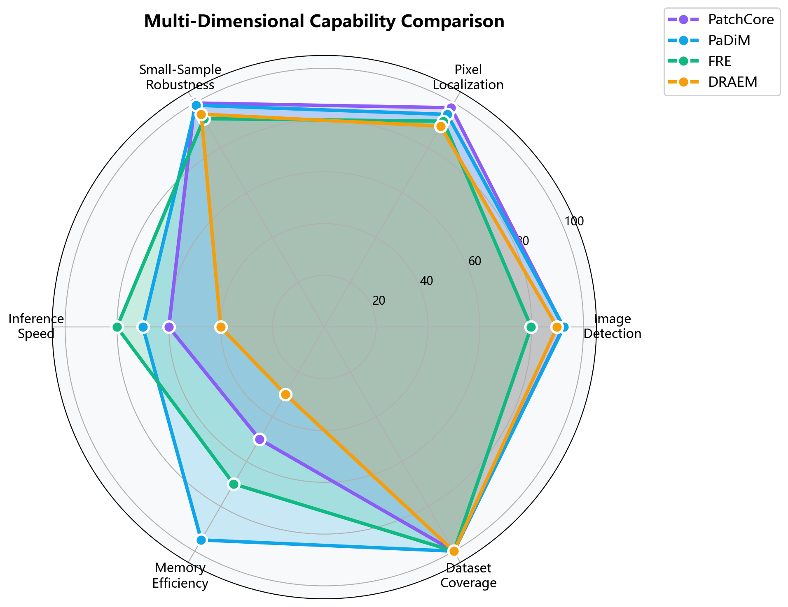

| 排名 | 模型 | 平均 AUROC | 平均 Pixel AUROC | 平均 PRO | 覆盖数据集 | 综合评级 |
|:---:|------|:---:|:---:|:---:|:---:|:---:|
| 🥇 | **PatchCore** | 92.22% | **97.94%** | **51.06%** | **6/6** | ★★★★★ |
| 🥈 | PaDiM | **92.44%** | 94.94% | 52.17% | **6/6** | ★★★★☆ |
| 🥉 | DRAEM | 89.83% | 89.67% | 39.82% | 6/6 | ★★★☆☆ |
| 4 | FRE | 79.80% | 91.93% | 30.08% | 6/6 | ★★☆☆☆ |

---

## 第六章 企业选型与落地建议

### 6.1 决策矩阵

根据工业部署的实际考量维度，构建如下决策矩阵（★ 越多越优）：

| 评估维度 | PatchCore | PaDiM | FRE | DRAEM |
|----------|:---:|:---:|:---:|:---:|
| 检测精度 (公开数据) | ★★★★★ | ★★★★★ | ★★★★☆ | ★★★★☆ |
| 检测精度 (企业数据) | ★★★★★¹ | ★★★★☆ | ★★☆☆☆ | ★★★★☆ |
| 定位精度 (PRO) | ★★★☆☆ | ★★★☆☆ | ★★☆☆☆ | ★★☆☆☆ |
| 小样本鲁棒性 (N≤60) | ★★★★★ | ★★★★☆ | ★★★☆☆ | ★★★★☆ |
| 推理速度 | ★★★☆☆ | ★★★★☆ | ★★★★☆ | ★★☆☆☆ |
| 显存占用 | ★★★☆☆ | ★★★★★ | ★★★★☆ | ★★☆☆☆ |
| 模型大小 | ★★★☆☆ | ★★★★★ | ★★★★☆ | ★☆☆☆☆ |
| 训练/建库时间 | ★★★★★ | ★★★★★ | ★★★★☆ | ★★★☆☆ |
| 新增样本可维护性 | ★★★★★ | ★★★★☆ | ★★☆☆☆ | ★★☆☆☆ |
| 可解释性 | ★★★☆☆ | ★★★★★ | ★★★★☆ | ★★★☆☆ |
| 工程成熟度 | ★★★★★ | ★★★★☆ | ★★★☆☆ | ★★★☆☆ |

> ¹ PatchCore 仅在企业数据 region1 上完成评测（AUROC 99.8%），企业覆盖度有限。

### 6.2 分场景推荐方案

#### 场景 A：高精度服务器端检测（推荐首选）

**推荐方案：PatchCore**

- **理由**：在 bottle (100%)、carpet (98.7%)、region1 (99.8%) 上均取得最优 AUROC
- **硬件需求**：≥4GB VRAM GPU，支持 CUDA
- **部署注意**：
  - 记忆库大小随产品复杂度增长，需定期评估是否需要重新采样
  - 建议搭配 SSD 存储记忆库文件以加速加载
  - 如需检测多种产品，可为每种产品维护独立记忆库

#### 场景 B：边缘端轻量级部署

**推荐方案：PaDiM (resnet18 backbone)**

- **理由**：仅 2.8M 参数，196MB 显存，431ms 推理，bottle 上仍达 100% AUROC
- **硬件需求**：≥2GB VRAM 的 Jetson 或边缘 GPU
- **部署注意**：
  - 使用 resnet18 backbone（放弃 wide_resnet50_2 的 6% PRO 提升，换取 25 倍的参数缩减）
  - 协方差模型可预计算并序列化，推理时仅需加载统计量

#### 场景 C：复杂环境高噪声产线

**推荐方案：DRAEM（或 DRAEM + PaDiM 级联）**

- **理由**：在 region2/3/5 等复杂企业数据上表现优于其他方法
- **级联策略**：PaDiM 做初筛（低阈值、高召回），DRAEM 做复核（精细分割）
- **硬件需求**：≥4GB VRAM GPU
- **部署注意**：
  - 推理延迟 1349ms，不适用于高速流水线
  - 建议通过 ONNX 导出或 TensorRT 优化将延迟降至 < 500ms

#### 场景 D：快速原型验证 / 新产品上线

**推荐方案：FRE**

- **理由**：推理最快（347ms），训练最快（~5min），在新产品上的快速验证能力强
- **注意**：精度在企业数据上不足，仅用于初筛，不推荐作为主检测方案

### 6.3 实施路径建议

```
Phase 1 (1-2周)           Phase 2 (2-4周)           Phase 3 (持续)
快速验证                  精度优化                   产线部署
──────────────────────────────────────────────────────────────→
PatchCore 建库测试       参数消融确定最优配置      导出 ONNX/TensorRT
  ↓                        ↓                          ↓
PaDiM 并行对照           小样本验证确保鲁棒性      边缘设备适配
  ↓                        ↓                          ↓
FRE 快速对比             阈值调优 (基于产线容忍度)  监控 + 模型更新
                           ↓
                         混淆矩阵分析 (控制误报/漏检)
```

### 6.4 风险与局限性

| 风险 | 影响 | 缓解措施 |
|------|------|----------|
| **PatchCore coreset O(n²)** | 大样本量或大尺寸图像下建库耗时较长 | 本课题在 6/6 数据集完成评测（约 1.5 分钟/数据集），合理且可行 |
| **PRO 指标普遍偏低** | 像素级定位连续性不足，微小缺陷漏检 | 后处理：NMS + 形态学闭运算；多尺度融合；考虑 CRF 后处理 |
| **企业数据域偏移** | 灰度图 vs 预训练 RGB 模型 → 特征分布偏移 | 在目标域正常样本上微调 backbone 的 BN 层（Feature Adaption） |
| **DRAEM 合成异常与真实缺陷差异** | 纹理类场景 (carpet) 效果差 | 结合真实缺陷样本的纹理特征改进合成策略 |
| **小样本下的协方差估计不准** | PaDiM 在 N<60 时性能下降 | 使用 Shrinkage Estimator 改进协方差估计；或退化为对角协方差 |

---

## 第七章 可视化验证平台

### 7.1 平台概述

本课题基于 Gradio 框架开发了一套交互式 Web 可视化验证平台，满足课题验收的可视化要求。平台支持模型的切换、推理、结果展示和多模型对比。

**访问方式**：本地启动后浏览器访问 `http://127.0.0.1:7860`

### 7.2 核心功能

| 功能模块 | 说明 | 任务书对应 |
|----------|------|-----------|
| 模型推理 | 上传单张图像 → 选定算法 → 输出异常热力图 + 得分 | 模型推理展示 |
| 四模型对比 | 同一张图像同时在 4 种算法上推理，并排展示 | 模型对比 |
| 结果可视化 | 原始图 + 热力图叠加 + NMS 边界框 + 异常分数 | 结果可视化 |
| 参数调节 | 支持调整 NMS 阈值，观察对检测结果的影响 | — |
| 多数据集支持 | bottle / carpet / region1-5 均可选择 | — |

### 7.3 技术架构

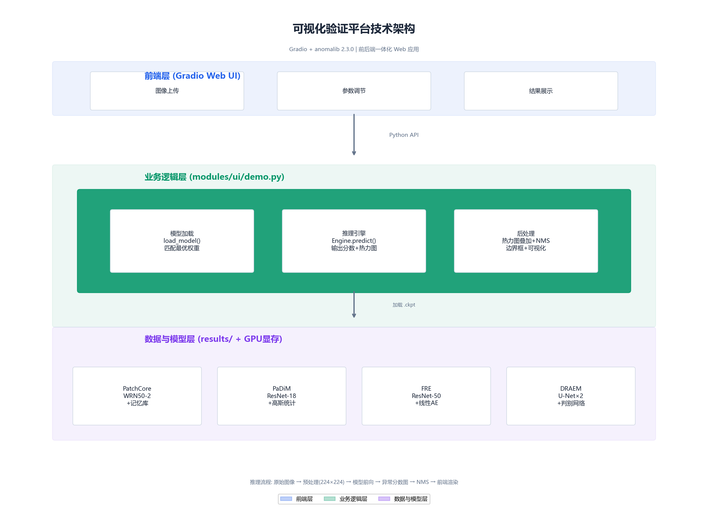

**三层架构说明**：

| 层级 | 技术栈 | 核心职责 |
|------|--------|----------|
| **前端层** | Gradio Web UI | 图像上传、参数调节、结果展示 |
| **业务逻辑层** | Python + anomalib 2.3 | AnomalyDetector 类：模型加载 → Engine.predict() 推理 → 后处理（热力图叠加 + NMS 边界框） |
| **数据与模型层** | 文件系统 + GPU 显存 | 4 种算法 checkpoint 的自动匹配与加载 |

**推理数据流**：原始图像 → 预处理 (224×224) → 模型前向传播 → 异常分数图 → NMS 边界框 → 前端渲染

### 7.4 说明

该平台满足课题验收的可视化要求，但企业实际部署将采用集成度更高的后端 API 方案，不直接使用 Gradio 前端。

---

## 第八章 总结与展望

### 8.1 核心结论

本课题在 ≤150 张正常样本的严格约束下，对无监督工业异常检测领域的三类技术路线、四种代表性算法进行了系统性复现与评测。在 MVTec AD 公开数据集和征图 Focusight 企业真实数据集上，共完成 24 组基准对比实验（4 算法 × 6 数据集全覆盖）、9 组消融实验、16 组小样本鲁棒性实验和 24 组混淆矩阵分析。主要结论如下：

1. **特征建模类方法（PatchCore/PaDiM）是当前工业场景下综合表现最优的技术路线**。两类方法均无需梯度训练，小样本鲁棒性极强（N=30 时 image_AUROC 保持 ≥ 99.4%），且部署灵活——PatchCore 适合服务器端高精度检测，PaDiM（2.8M 参数）适合边缘端轻量部署。

2. **自监督判别类方法（DRAEM）在企业高噪声复杂场景下有独特价值**。在 region3/5 等公开数据集方法表现不佳的数据集上，DRAEM 取得了最优的图像级检测性能。但其推理成本高（1349ms，97.4M 参数），不适合对实时性要求高的场景。

3. **特征重构类方法（FRE）在域偏移下鲁棒性不足**。在 MVTec AD 上表现尚可（bottle 99.4%），但在企业灰度图数据上大幅退化（region5 仅 57.4%），反映了 ImageNet 预训练特征与工业灰度图之间的域差异对重构范式的根本性挑战。

4. **小样本鲁棒性实验揭示了不同范式的本质差异**：不需要训练的方法（PatchCore/PaDiM）几乎不受样本量影响；需要训练的方法（FRE/DRAEM）在像素级定位上受样本量影响显著，其中 DRAEM 的 PRO 在 N=30 时较 N=150 时下降约 38%。

5. **PRO 指标是当前无监督异常定位的共性瓶颈**。所有方法在所有数据集上的 PRO 均显著低于其他三项指标，企业数据上多数 < 50%。这说明像素级定位的连续性（区域完整性）仍是未解决的问题。

### 8.2 工作局限性

1. **PRO 优化不足**：本课题专注于算法对比，未对像素级后处理（连通域滤波、边缘细化、CRF 后处理等）做系统优化，而这是提升 PRO 的关键手段。

3. **数据集局限性**：企业数据仅覆盖触控面板一个产品类型，MVTec AD 仅选取 2 个类别，结论的泛化性需在更多产品类型上验证。

4. **未涉及方法创新**：本课题以复现和对比评测为主，未提出新的算法架构或改进策略。

5. **预训练大模型路线未覆盖**：受限于硬件和工程周期（详见 2.6 节），第四类技术路线未完整实现。

### 8.3 未来工作方向

1. **PRO 专项优化**：引入 CRF（条件随机场）后处理、多尺度融合、自适应阈值策略，系统性提升定位连续性。目标：企业数据 PRO 提升至 60%+。

3. **Feature Adaption**：在企业灰度图上微调预训练 backbone 的 BN 层统计量（仅需正常样本、无需标注），缓解域偏移问题。预期可显著提升 FRE 在企业数据上的表现。

4. **轻量级模型蒸馏**：将 DRAEM 的判别能力蒸馏至轻量网络（参考 EfficientAD 路线），在保持精度的同时将推理延迟控制在 100ms 以内。

5. **多产品统一模型**：探索单一模型同时检测多种产品的能力，降低多产品产线的部署和维护成本。

6. **扩散模型方法探索**：DDPM/Diffusion 在 2024-2025 年的图像异常检测中展现了潜力，可作为技术储备跟进。

---

## 参考文献

1. Bergmann P, Fauser M, Sattlegger D, et al. MVTec AD — A comprehensive real-world dataset for unsupervised anomaly detection. *CVPR*, 2019.
2. Roth K, Pemula L, Zepeda J, et al. Towards total recall in industrial anomaly detection. *CVPR*, 2022.
3. Defard T, Setkov A, Loesch A, et al. PaDiM: A patch distribution modeling framework for anomaly detection and localization. *ICPR*, 2021.
4. Batzner K, et al. Feature reconstruction error for anomaly detection. 2024.
5. Zavrtanik V, Kristan M, Skočaj D. DRAEM — A discriminatively trained reconstruction embedding for surface anomaly detection. *ICCV*, 2021.
6. Li C L, Sohn K, Yoon J, et al. CutPaste: Self-supervised learning for anomaly detection and localization. *CVPR*, 2021.
7. Jeong J, Zou Y, Kim T, et al. WinCLIP: Zero-/few-shot anomaly classification and segmentation. *CVPR*, 2023.
8. Cohen N, Hoshen Y. Sub-image anomaly detection with deep pyramid correspondences. *CVPR*, 2020.
9. Bergmann P, Batzner K, Fauser M, et al. The MVTec anomaly detection dataset: A comprehensive real-world dataset for unsupervised anomaly detection. *IJCV*, 2021.
10. Batzner K, et al. EfficientAD: Accurate visual anomaly detection at millisecond-level latencies. *WACV*, 2024.

---

## 附录 A：完整实验结果数据表

完整的 24 组实验 JSON 文件存放于 `results/comparison/` 目录下（4 算法 × 6 数据集全覆盖）。以下为汇总表。

### A.1 图像级指标汇总

| 模型 | 数据集 | Image AUROC | Image AUPR | Pixel AUROC | PRO | 最优阈值 |
|------|--------|:---:|:---:|:---:|:---:|:---:|
| PatchCore | bottle | 100.00% | 99.81% | 98.56% | 80.14% | 0.31 |
| PatchCore | carpet | 98.72% | 99.64% | 99.07% | 65.94% | 0.50 |
| PatchCore | region1 | 99.84% | 92.35% | 99.89% | 39.79% | 0.33 |
| PatchCore | region2 | 78.57% | 33.52% | 92.87% | 15.93% | 0.93 |
| PatchCore | region3 | 97.61% | 68.61% | 99.84% | 69.51% | 0.94 |
| PatchCore | region5 | 78.60% | 48.69% | 97.43% | 35.04% | 0.71 |
| PaDiM | bottle | 100.00% | 99.81% | 98.24% | 80.21% | 0.50 |
| PaDiM | carpet | 98.68% | 99.58% | 98.72% | 75.39% | 0.50 |
| PaDiM | region1 | 97.33% | 68.28% | 99.86% | 50.24% | 0.91 |
| PaDiM | region2 | 73.48% | 46.94% | 73.87% | 10.19% | 0.54 |
| PaDiM | region3 | 97.29% | 67.39% | 99.75% | 62.77% | 0.96 |
| PaDiM | region5 | 87.86% | 59.60% | 99.21% | 34.24% | 0.65 |
| FRE | bottle | 99.37% | 99.61% | 97.51% | 69.08% | 0.56 |
| FRE | carpet | 94.22% | 98.35% | 98.58% | 57.13% | 0.50 |
| FRE | region1 | 75.59% | 29.31% | 95.82% | 4.80% | 0.28 |
| FRE | region2 | 64.10% | 30.46% | 80.44% | 5.43% | 0.80 |
| FRE | region3 | 88.08% | 37.19% | 99.55% | 38.14% | 0.55 |
| FRE | region5 | 57.43% | 26.05% | 79.71% | 5.90% | 0.00 |
| DRAEM | bottle | 97.70% | 99.28% | 86.20% | 48.28% | 0.50 |
| DRAEM | carpet | 84.55% | 94.88% | 91.19% | 40.85% | 0.86 |
| DRAEM | region1 | 98.27% | 80.31% | 87.71% | 35.50% | 0.75 |
| DRAEM | region2 | 68.86% | 52.85% | 77.52% | 11.22% | 0.51 |
| DRAEM | region3 | 98.82% | 79.59% | 99.36% | 56.50% | 0.55 |
| DRAEM | region5 | 90.78% | 68.03% | 96.05% | 46.58% | 0.77 |

## 附录 B：消融实验完整数据

> 全部实验在 bottle 数据集上进行。

### B.1 PatchCore: coreset_sampling_ratio 消融

| coreset_ratio | Image AUROC | Image AUPR | Pixel AUROC | PRO |
|:---:|:---:|:---:|:---:|:---:|
| 0.01 | 100.00% | 99.81% | 98.53% | 79.29% |
| 0.05 | 100.00% | 99.81% | 98.55% | 80.09% |
| 0.10 | 100.00% | 99.81% | 98.56% | 81.29% |
| 0.20 | 100.00% | 99.81% | 98.57% | 81.46% |

**结论**：0.10 是精度/效率最佳平衡点。0.10→0.20 的 PRO 边际增益仅 0.17%，但记忆库大小翻倍。

### B.2 PaDiM: backbone 消融

| backbone | Image AUROC | Image AUPR | Pixel AUROC | PRO |
|----------|:---:|:---:|:---:|:---:|
| resnet18 | 100.00% | 99.81% | 98.05% | 79.88% |
| wide_resnet50_2 | 100.00% | 99.81% | 98.28% | 85.85% |

**结论**：更强大的 backbone 在 PRO 上提升 5.97 个百分点。代价是参数量增加约 25 倍。

### B.3 FRE: latent_dim 消融

| latent_dim | Image AUROC | Image AUPR | Pixel AUROC | PRO |
|:---:|:---:|:---:|:---:|:---:|
| 100 | 99.37% | 99.61% | 97.51% | 70.22% |
| 220 | 99.52% | 99.66% | 97.50% | 69.29% |
| 500 | 99.21% | 99.59% | 97.33% | 67.18% |

**结论**：latent_dim=220 时图像级分类最优。PRO 随 latent_dim 增大而单调下降（信息瓶颈效应）。

---

## 附录 C：小样本鲁棒性完整数据

> 数据集：bottle，样本量从 209 张训练集中随机采样，seed=42。

### C.1 N=30

| 模型 | Image AUROC | Image AUPR | Pixel AUROC | PRO |
|------|:---:|:---:|:---:|:---:|
| PatchCore | 100.00% | 99.81% | 98.53% | 79.39% |
| PaDiM | 99.44% | 99.66% | 97.94% | 79.03% |
| FRE | 97.62% | 99.22% | 97.55% | 72.35% |
| DRAEM | 98.25% | 99.37% | 86.15% | 42.38% |

### C.2 N=60

| 模型 | Image AUROC | Image AUPR | Pixel AUROC | PRO |
|------|:---:|:---:|:---:|:---:|
| PatchCore | 100.00% | 99.81% | 98.53% | 80.25% |
| PaDiM | 99.76% | 99.74% | 98.22% | 80.78% |
| FRE | 99.29% | 99.65% | 97.50% | 69.76% |
| DRAEM | 98.17% | 99.44% | 88.97% | 47.91% |

### C.3 N=100

| 模型 | Image AUROC | Image AUPR | Pixel AUROC | PRO |
|------|:---:|:---:|:---:|:---:|
| PatchCore | 100.00% | 99.81% | 98.54% | 81.76% |
| PaDiM | 99.76% | 99.74% | 98.21% | 78.89% |
| FRE | 99.37% | 99.61% | 97.49% | 68.96% |
| DRAEM | 98.41% | 99.45% | 85.35% | 35.49% |

### C.4 N=150

| 模型 | Image AUROC | Image AUPR | Pixel AUROC | PRO |
|------|:---:|:---:|:---:|:---:|
| PatchCore | 100.00% | 99.81% | 98.55% | 80.98% |
| PaDiM | 100.00% | 99.81% | 97.99% | 82.15% |
| FRE | 99.37% | 99.61% | 97.50% | 68.58% |
| DRAEM | 97.94% | 99.42% | 83.56% | 46.83% |

### C.5 小样本鲁棒性汇总 (Image AUROC %)

| N | PatchCore | PaDiM | FRE | DRAEM |
|:---:|:---:|:---:|:---:|:---:|
| 30 | 100.00 | 99.44 | 97.62 | 98.25 |
| 60 | 100.00 | 99.76 | 99.29 | 98.17 |
| 100 | 100.00 | 99.76 | 99.37 | 98.41 |
| 150 | 100.00 | 100.00 | 99.37 | 97.94 |
| **Δ(N30→N150)** | **0.00** | **+0.56** | **+1.75** | **−0.31** |

---

## 附录 D：推理基准测试完整数据

> 测试环境：NVIDIA RTX 4060 Laptop GPU (8GB)，CUDA 11.8。数据集：bottle。预热 3 次后计时 10 次取平均。

| 模型 | 可训参数 | 总参数 | 推理时间 (ms) | 标准差 (ms) | 最小值 (ms) | 最大值 (ms) | 显存 (MB) |
|------|:---:|:---:|:---:|:---:|:---:|:---:|:---:|
| FRE | 23,026,972 | 23,026,972 | 347.4 | 15.0 | 327.3 | 374.5 | 318 |
| PaDiM | 2,782,784 | 2,782,784 | 431.0 | 27.2 | 404.9 | 497.5 | 196 |
| PatchCore | 24,862,528 | 24,862,528 | 562.8 | 81.9 | 474.9 | 722.4 | 463 |
| DRAEM | 97,422,725 | 97,422,725 | 1348.5 | 199.0 | 1121.3 | 1710.9 | 924 |

> 注：PatchCore 参数不含记忆库存储（约 77MB 额外开销）。PaDiM 参数不含协方差统计量（可忽略）。

---

## 附录 E：混淆矩阵完整数据

> 所有混淆矩阵基于 Youden's J 最优阈值计算。正类 = 缺陷（异常），负类 = 正常。

### E.1 PatchCore 混淆矩阵

| 数据集 | 阈值 | TP | FP | TN | FN | 总计 | 准确率 | 精确率 | 召回率 |
|--------|:---:|:---:|:---:|:---:|:---:|:---:|:---:|:---:|:---:|
| bottle | 0.31 | 63 | 0 | 20 | 0 | 83 | 100.0% | 100.0% | 100.0% |
| carpet | 0.50 | 86 | 1 | 27 | 3 | 117 | 96.6% | 98.9% | 96.6% |
| region1 | 0.33 | 7 | 8 | 83 | 0 | 98 | 91.8% | 46.7% | 100.0% |

### E.2 PaDiM 混淆矩阵

| 数据集 | 阈值 | TP | FP | TN | FN | 总计 | 准确率 | 精确率 | 召回率 |
|--------|:---:|:---:|:---:|:---:|:---:|:---:|:---:|:---:|:---:|
| bottle | 0.50 | 62 | 0 | 20 | 1 | 83 | 98.8% | 100.0% | 98.4% |
| carpet | 0.50 | 85 | 0 | 28 | 4 | 117 | 96.6% | 100.0% | 95.5% |
| region1 | 0.91 | 2 | 0 | 91 | 5 | 98 | 94.9% | 100.0% | 28.6% |
| region2 | 0.54 | 4 | 0 | 91 | 11 | 106 | 89.6% | 100.0% | 26.7% |
| region3 | 0.96 | 1 | 0 | 150 | 16 | 167 | 90.4% | 100.0% | 5.9% |
| region5 | 0.65 | 4 | 2 | 89 | 19 | 114 | 81.6% | 66.7% | 17.4% |

### E.3 FRE 混淆矩阵

| 数据集 | 阈值 | TP | FP | TN | FN | 总计 | 准确率 | 精确率 | 召回率 |
|--------|:---:|:---:|:---:|:---:|:---:|:---:|:---:|:---:|:---:|
| bottle | 0.56 | 55 | 0 | 20 | 8 | 83 | 90.4% | 100.0% | 87.3% |
| carpet | 0.50 | 81 | 4 | 24 | 8 | 117 | 89.7% | 95.3% | 91.0% |
| region1 | 0.28 | 2 | 3 | 88 | 5 | 98 | 91.8% | 40.0% | 28.6% |
| region2 | 0.80 | 2 | 0 | 91 | 13 | 106 | 87.7% | 100.0% | 13.3% |
| region3 | 0.55 | 9 | 15 | 135 | 8 | 167 | 86.2% | 37.5% | 52.9% |
| region5 | 0.00 | 23 | 91 | 0 | 0 | 114 | 20.2% | 20.2% | 100.0% |

### E.4 DRAEM 混淆矩阵

| 数据集 | 阈值 | TP | FP | TN | FN | 总计 | 准确率 | 精确率 | 召回率 |
|--------|:---:|:---:|:---:|:---:|:---:|:---:|:---:|:---:|:---:|
| bottle | 0.50 | 60 | 0 | 20 | 3 | 83 | 96.4% | 100.0% | 95.2% |
| carpet | 0.86 | 24 | 0 | 28 | 65 | 117 | 44.4% | 100.0% | 27.0% |
| region1 | 0.753 | 2 | 0 | 91 | 5 | 98 | 94.9% | 100.0% | 28.6% |
| region2 | 0.51 | 9 | 6 | 85 | 6 | 106 | 88.7% | 60.0% | 60.0% |
| region3 | 0.55 | 9 | 1 | 149 | 8 | 167 | 94.6% | 90.0% | 52.9% |
| region5 | 0.77 | 6 | 3 | 88 | 17 | 114 | 82.5% | 66.7% | 26.1% |

---

## 附录 F：代码仓库使用说明

### F.1 环境配置

```bash
# 创建环境
mamba create -n anomalib python=3.10 -y
mamba activate anomalib

# 安装依赖
mamba install pytorch torchvision pytorch-cuda=11.8 -c pytorch -c nvidia -y
pip install anomalib>=2.0.0 opencv-python==4.8.1.78 timm gradio
```

### F.2 快速复现

```bash
# 数据处理
python scripts/run_data_processing.py -i ./data/raw -o ./data/processed/bottle

# 单模型训练
python scripts/run_training.py -m patchcore -c bottle -d ./data

# 全部模型/全部数据集
python scripts/run_training.py -m all -c all -d ./data

# 生成报告
python tools/run_report.py

# 启动 UI
python scripts/run_ui.py
```

### F.3 可复现性声明

- 所有随机种子固定为 `seed=42`
- 所有配置文件版本受 Git 追踪
- 所有实验结果附带时间戳和完整配置
- 预训练权重使用 ImageNet 官方权重

---

> **报告完成时间**：2026-06-12
> **基于**：anomalib 2.3.0 | PyTorch 2.x | NVIDIA RTX 4060 Laptop GPU
> **完整代码仓库**：见项目根目录
> **实验数据**：见 `results/` 目录下各子目录
